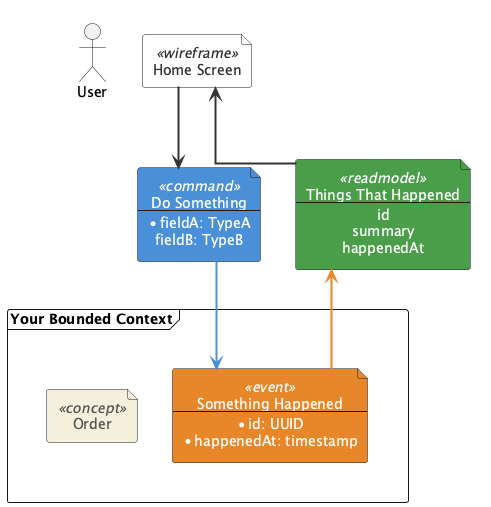
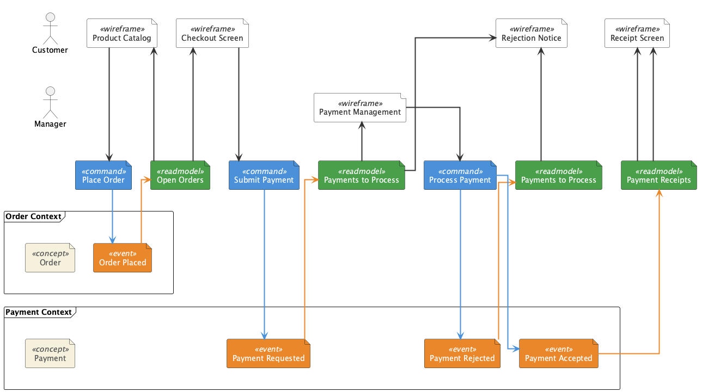
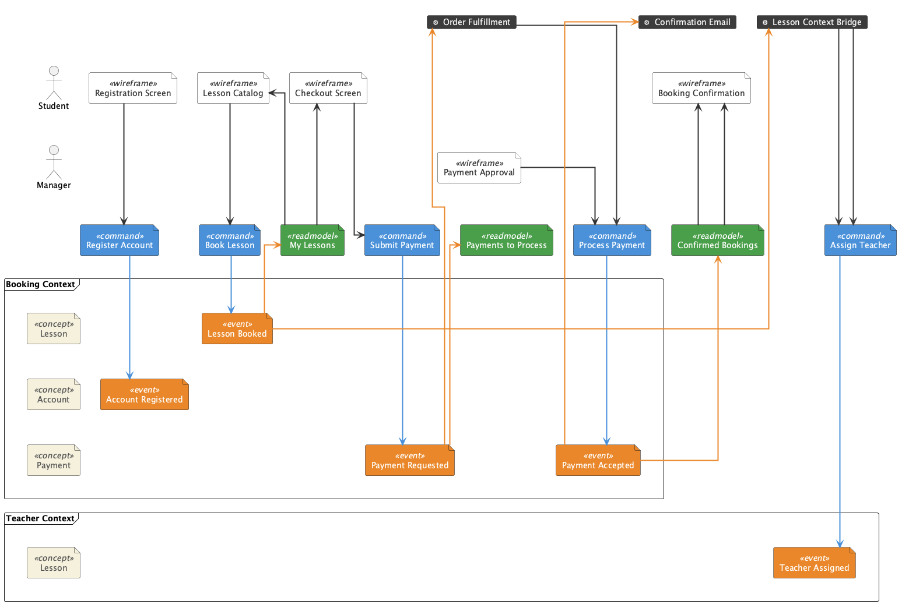
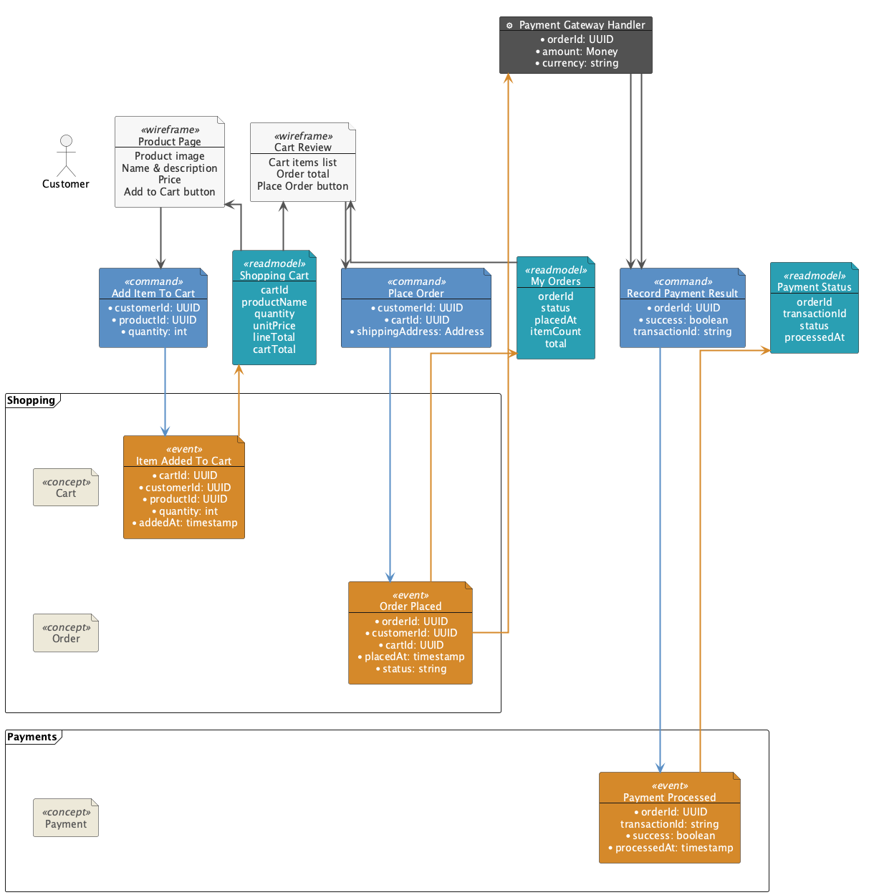
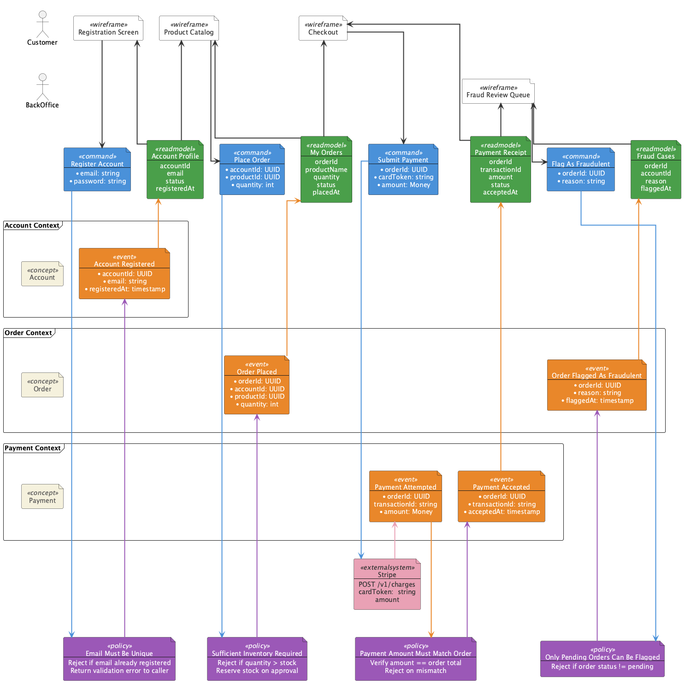
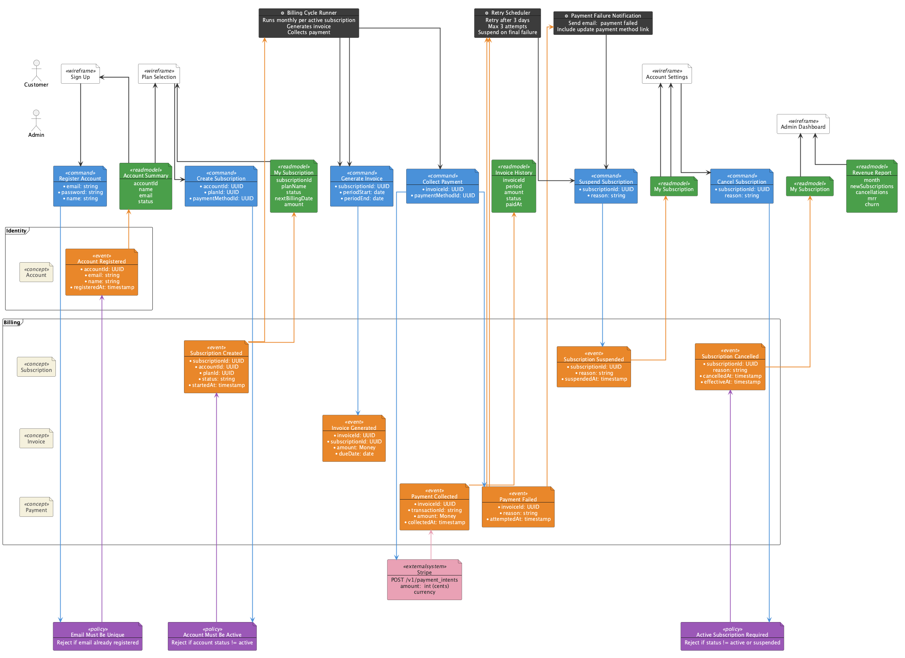
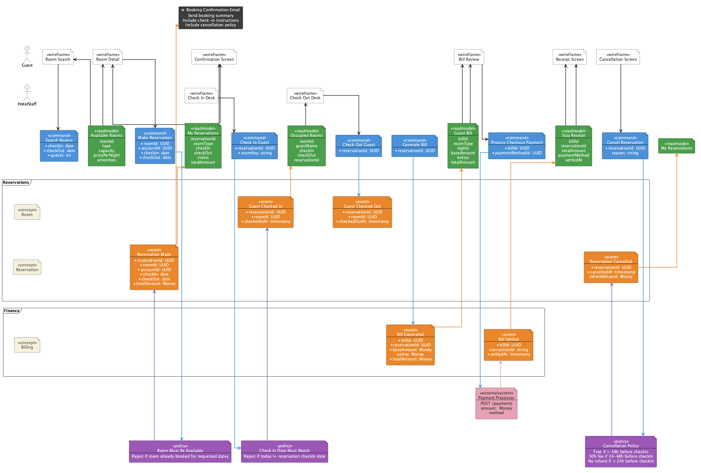

# event-model-plantuml

A PlantUML library for creating [Event Modeling](https://eventmodeling.org/) diagrams, designed for clarity, semantic precision, and AI-assisted decomposition.

Inspired by the [plantuml-event-modeling](https://github.com/chilit-nl/plantuml-event-modeling) library by Marries van de Hoef (chilit-nl). This library reimagines the element vocabulary to align with Adam Dimytruk's Event Modeling methodology and Martin Dilger's CQRS/event sourcing patterns, extends it with structured schema annotations, and adds slice markers for AI-assisted implementation decomposition.

> Only the default GraphViz layout engine is supported.

> **PlantUML limitation**: all procedure calls must be on a single line. Multi-line calls are not supported by the preprocessor.

---

## Remote Usage

Include the library directly from GitHub in any `.puml` file. No installation required.

**Latest (`main` branch)** — always the newest version:
```plantuml
!include_once https://raw.githubusercontent.com/milehimikey/event-model-plantuml/main/event-model-plantuml.iuml
```

**Pinned release** — recommended for reproducible diagrams:
```plantuml
!include_once https://raw.githubusercontent.com/milehimikey/event-model-plantuml/v1.0.0/event-model-plantuml.iuml
```

**Local** — download the file and include it relative to your diagram:
```plantuml
!include_once event-model-plantuml.iuml
```

Works with the [PlantUML online server](https://www.plantuml.com/plantuml), VS Code PlantUML extension, IntelliJ PlantUML plugin, and any tool that runs PlantUML with network access.

---

## Quick Example

```plantuml
@startuml
!include_once https://raw.githubusercontent.com/milehimikey/event-model-plantuml/main/event-model-plantuml.iuml

$enableAutoAlias()
$enableAutoLayout()

$actor(Customer)
$aggregate(Order, $context = "Order Context")

$screen(Product Catalog, Customer)
$command(Place Order, $schema = "customerId:UUID:required, productId:UUID:required, qty:int:required")
$event(Order Placed, Order, $schema = "orderId:UUID:required, placedAt:timestamp:required")
$readmodel(My Orders, $schema = "orderId, status, total")
$arrow(MyOrders, ProductCatalog)

$renderEventModelingDiagram()
@enduml
```

---

## Examples

### [00] Quickstart — minimum viable diagram



### [01] Basic flow — actors, aggregates, bounded contexts



### [02] Automation lane — `$automation`, `$translation`, `$saga`, `$processor`



### [03] Schema annotations and slice decomposition



### [04] Policies and integrations



### [05] Complete subscription billing system

Full model with registration, subscriptions, billing automation, failure handling, and admin reporting.



### [06] Hotel booking — full workshop domain

Demonstrates all 6 Event Modeling workshop steps in a single complete diagram.



---

## The 5 Building Blocks

| Element | Procedure | Color | Description |
|---|---|---|---|
| UI Screen | `$screen(name, actor)` | White | What the user sees and interacts with |
| Command | `$command(name)` | Blue | Intent to change state — the write API |
| Event | `$event(name, aggregate)` | Orange | A business fact that happened — past tense |
| Read Model | `$readmodel(name)` | Green | Queryable derived data — the read API |
| Automation | `$automation(name)` | Dark grey ⚙ | Lights-out process, no human involved |

---

## Setup Procedures

### `$actor(laneAlias, ...)`
Defines a swimlane for a user or external actor. Used to place `$screen` elements.

```plantuml
$actor(Customer)
$actor(BackOffice, $headingName = "Back Office Team")
```

### `$aggregate(laneAlias, $context = "")`
Defines a swimlane for a domain aggregate. Used to place `$event` elements. Aggregates within the same `$context` are visually grouped.

```plantuml
$aggregate(Order, $context = "Ordering")
$aggregate(Payment, $context = "Payments")
```

### `$enableAutoAlias()`
Automatically resolves duplicate names by appending a number (`Order`, `Order1`, `Order2`). Enable this when the same element name appears more than once.

### `$enableAutoLayout()`
Automatically positions elements horizontally based on their definition order.

---

## Element Reference

All element procedures share these optional parameters:

| Parameter | Default | Description |
|---|---|---|
| `$alias` | derived from name | Override the reference alias used in `$arrow()` calls |
| `$offset` | `0` | Horizontal offset adjustment (integer units) |
| `$arrow` | `1` | Set to `0` to suppress the automatic arrow from the previous element |
| `$figure` | `"file"` | Override the PlantUML deployment diagram figure type |
| `$fields` | `""` | Freeform display text below the element name (`\n` for line breaks) |
| `$schema` | `""` | Structured field definitions (see [Schema Annotations](#schema-annotations)) |

### `$screen(name, laneAlias, ...)`
A UI wireframe or screen. Place in an `$actor()` lane.

### `$command(name, ...)`
The user's or system's intent to change state. Name in **imperative present tense**: `PlaceOrder`, `CancelSubscription`.

### `$event(name, laneAlias, ...)`
A business fact that occurred. Name in **past tense**: `OrderPlaced`, `PaymentProcessed`. Place in an `$aggregate()` lane.

### `$readmodel(name, ...)`
Queryable, read-only data derived from events. Name as a **noun phrase**: `OrderList`, `CustomerProfile`.

### `$policy(name, ...)`
A business rule or invariant that reacts to events within a context. Policies may issue commands or reject changes.

### `$integration(name, laneAlias, ...)`
An external system or third-party service boundary (pink).

### `$question(name, ...)`
An unresolved design question (red). Useful during workshops to mark open issues.

---

## Automation Elements

All automation elements render with a ⚙ gear icon and dark grey style. Use the most semantically precise variant:

| Procedure | Use when... |
|---|---|
| `$automation(name)` | Generic event-driven process with no human involvement |
| `$translation(name)` | Context mapper between bounded contexts (anti-corruption layer) |
| `$saga(name)` | Long-running, stateful process spanning multiple aggregates |
| `$processor(name)` | Side-effect handler: email, SMS, push notifications, webhooks |

```plantuml
$automation(Fraud Check)
$translation(Order to Fulfillment)
$saga(Order Fulfillment)
$processor(Confirmation Email)
```

---

## Arrows

Auto-arrows are generated between sequentially defined elements when the transition is logically valid (e.g., command → event, event → readmodel). Use explicit arrow procedures for non-sequential connections.

| Procedure | Color | Use for |
|---|---|---|
| `$arrow($from, $to)` | Black | Read model → screen feedback |
| `$commandarrow($from, $to)` | Blue | Explicit command → event |
| `$eventarrow($from, $to)` | Orange | Explicit event → automation |
| `$automationarrow($from, $to)` | Dark grey | Explicit automation → command |
| `$policyarrow($from, $to)` | Purple | Explicit policy → command/event |
| `$integrationarrow($from, $to)` | Pink | Explicit integration → event |

---

## Schema Annotations

The `$schema` parameter provides machine-readable field definitions that also render as display text. This is the recommended format for AI-assisted workflows.

**Format**: `"fieldName:type:constraint, fieldName2:type, ..."`

- Constraints: `required` renders as a `•` bullet point (PlantUML creole), `optional` or omitted renders with no marker
- If `$schema` is provided and `$fields` is empty, display fields are auto-generated
- If both are provided, `$schema` is the machine-readable source and `$fields` overrides the display

```plantuml
$command(PlaceOrder,
    $schema = "customerId:UUID:required, productId:UUID:required, quantity:int:optional")

$event(OrderPlaced, Order,
    $schema = "orderId:UUID:required, customerId:UUID:required, placedAt:timestamp:required")

$readmodel(MyOrders,
    $schema = "orderId, customerName, status, total")
```

Use `$fields` for rich freeform display (supports [PlantUML creole](https://plantuml.com/creole)):

```plantuml
$screen(Product Page, Customer,
    $fields = "<b>Shows:</b>\n• Product image\n• Price\n• Add to Cart button")
```

---

## Slice Annotations

Slices mark **independent, deliverable vertical units** of the event model. Each slice is a complete flow from trigger to updated read model.

`$beginSlice` and `$endSlice` produce **no visual output** — they are source-level markers that AI agents parse to decompose the model into implementation tasks, acceptance criteria, or code scaffolding.

```plantuml
$beginSlice(PlaceOrder,
    $type = "StateChange",
    $description = "Customer places an order from the product catalog")

$screen(Product Catalog, Customer)
$command(Place Order, $schema = "customerId:UUID:required, productId:UUID:required")
$event(Order Placed, Order, $schema = "orderId:UUID:required, placedAt:timestamp:required")
$readmodel(My Orders)
$arrow(MyOrders, ProductCatalog)

$endSlice()
```

**Slice types** (Dimytruk's canonical patterns):

| Type | Pattern | Description |
|---|---|---|
| `StateChange` | screen → command → event | User changes system state |
| `StateView` | event → readmodel → screen | System shows derived data |
| `Automation` | event → automation → command → event | Lights-out automated process |

---

## Rendering

Place `$renderEventModelingDiagram()` as the **last statement** before `@enduml`. It triggers the two-phase layout render.

```plantuml
$renderEventModelingDiagram()
@enduml
```

---

## Naming Conventions

Following Adam Dimytruk's Event Modeling vocabulary:

- **Events** — past tense, business-significant facts: `OrderPlaced`, `PaymentProcessed`
- **Commands** — imperative present tense: `PlaceOrder`, `ProcessPayment`
- **Read Models** — noun phrases: `OrderList`, `PaymentHistory`
- **Aggregates** — nouns, singular: `Order`, `Payment`, `Customer`
- **Slices** — imperative or noun: `PlaceOrder`, `CustomerRegistration`

---

## Backward Compatibility

Diagrams written for the [chilit-nl plantuml-event-modeling](https://github.com/chilit-nl/plantuml-event-modeling) library are supported via shims:

| Old name | New name |
|---|---|
| `$wireframe` | `$screen` |
| `$view` | `$readmodel` |
| `$extra` | `$automation` |
| `$externalsystem` | `$integration` |
| `$configureWireframeLane` | `$actor` |
| `$configureEventLane` | `$aggregate` |
| `$enableAutoSpacing` | `$enableAutoLayout` |
| `$externalsystemarrow` | `$integrationarrow` |

---

## License

MIT
